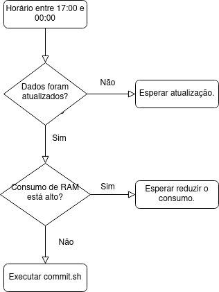

\newpage
\tableofcontents
\newpage

# Introdução

Este relatório tem como objetivo descrever os métodos, tratamentos e procedimentos utilizados, além das dificuldades enfrentadas para obter, manipular e organizar os dados da pandemia de COVID-19 no Brasil e no Mundo e construir um [**painel interativo**](https://luckermos.shinyapps.io/covidmundo/) a partir do software *R*.

\newpage

# Obtenção dos Dados

Foram coletados dados a nível mundial a partir do [**Repositório da Universidade Johns  Hopkins (JHU)**](https://github.com/CSSEGISandData) e a nível nacional por meio do [**Ministério da Saúde (MS)**](https://covid.saude.gov.br). O primeiro a partir do próprio Github em que os dados diários são depositados em arquivos separados. Já para o segundo foi utilizada a API dos dados disponibilizados.  
Para a coleta automática dos dados, que se atualizam diariamente, foi construído um cronjob que coleta os dados dos repositórios citados e os disponibiliza no [**Repositório GitHub**](https://github.com/sjlva/Covid19BR) em um formato mais compacto e de mais rápida leitura pelo R (.rds).  Para atualizar os dados em formato .rds neste repositório diariamente, foi criado um cron job (ver pasta cronjob do projeto).

Cron job é uma ferramenta que permite agendar e controlar tarefas a serem executadas em tempos especificados. Isto é, podemos, através deste método definir rotinas que serão executadas em horários específicos.

Na pasta `cronjob` é possível encontrar 4 arquivos:  
1. `get_ms_data.R`: baixa dados a nível nacional (Brasil).  
2. `get_jhu_data.R`: baixa dados a nível mundial.  
3. `get_google_data.R`:baixa dados de mobilidade do Google.  
4. `commit.sh`: acessa a pasta `cronjob` e executa os 3 scripts acima e, após isso, adiciona ao [**Covid19BR**](https://github.com/sjlva/Covid19BR) os arquivos atualizados.    

Podemos entender melhor o funcionamento desta rotina pelo fluxograma abaixo:  

{ width=50% }

Esta foi a maneira encontrada para solucionar o problema de leitura e acesso automático aos dados. Principalmente porque os dados da Johns Hopkins são separados em arquivos diários e cada arquivo pode sofrer atualizações isoladas forçando a leitura de todos os arquivos para uma atualização correta das informações. Além disso, inicialmente, os dados do Ministério da Saúde eram disponibilizados em formato .xlsx que são arquivos muito grandes e de lenta leitura. Desta forma, o painel interativo utiliza as funções criadas para obter os dados utilizados na análise de maneira mais fácil e rápida.  

Outro ponto que dificultou a criação de um método automático de tratamento dos dados do MS foram as constantes mudanças no formato do arquivo assim como sua compactação. Por vezes foi necessário remodelar a forma de leitura, filtros e tratamento dos dados.

\newpage

# Estrutura do Painel

O painel interativo foi construído baseado em um documento [*Rmarkdown*](https://rmarkdown.rstudio.com) que é geralmente utilizado para elaborar relatórios em PDF ou HTML de modo a unir códigos em *R*, *outputs* destes códigos e escrita na sintaxe *markdown*.  

Além disso, foram utilizados recursos do [*Shiny*](https://shiny.rstudio.com) juntamente com o *Rmarkdown*, criando os chamados [**Documentos Interativos**](https://bookdown.org/yihui/rmarkdown/interactive-documents.html) que são, basicamente, documentos *Rmarkdown* com recursos interativos ou funções reativas do *Shiny*.  

Desta forma, o painel foi elaborado baseado em 3 abas:

* Covid-19 no Mundo  
Compreende as análises a nível mundial: por país, por continente e no mundo como um todo.  
* Covid-19 no Brasil (Dados do MS)  
Analisa os dados da Covid-19 no Brasil a nível de UF, regional e nacional.  
* Covid-19 por UF (Dados do MS)  
Possui visões a nível municipal dado um estado.  

Dentre as visões construídas estão:

- Mapas Interativos: com os dados da data-base mais recente disponível.  
- Evolução dos principais indicadores: casos e óbitos (acumulados, diários e semanais) nos diversos níveis de análise.  
- Comparação de continentes, países, regiões e estados com relação aos indicadores de casos e óbitos (acumulados, diários, semanais e por habitantes). Nestas visões é possível escolher interativamente quais unidades comparar (recursos do *Shiny*).  

O painel obteve, ainda, sua estrutura construída por meio de um estilo .css obtido no [Bootswatch](https://bootswatch.com/3/slate/). E para que os gráficos combinem com o tema escolhido foi criado um tema específico para os gráficos do `ggplot2`. Além disso, para que os gráficos construídos sejam interativos permitindo uma navegação mais atrativa e coerente com o pacote, os gráficos *ggplot* foram convertidos para gráficos interativos *plotly* por meio da função *ggplotly()*. Também foram acrescentadas legendas interativas.

\newpage

# Tratamento dos Dados

Para obter as visões descritas anteriormente foi necessário uma grande manipulação das bases de dados.  

As bases de dados da Covid tanto da Johns Hopkins quanto do Ministério da Saúde precisaram ser filtradas, as informações agrupadas e sumarizadas de acordo com nível da análise a ser realizada. Isso foi feito por meio do pacote `dplyr` e as funções `filter()`, `group_by()` e `summarise()`. 

## Base de Dados do MS

Para a base de dados do MS, em especial, como os dados se dispunham de forma empilhada dos dados agrupados por município, por estado e para o Brasil como um todo, foi necessário aplicar diferentes filtros: 

* Para se ter as informações apenas a nível de município filtrou-se a base de forma a selecionar apenas as observações cuja coluna 'municipio' não estivesse nula. Pois os dados sumarizados a nível de estado e Brasil possuíam esse campo nulo.  
* Para se obter as informações por estado, removeu-se as observações sem o nome do 'estado' (eliminando as informações do Brasil com um todo) e, em sequência, removeu-se as linhas com nome do 'municipio', isolando apenas a visão por estado.  
* Já para se ter os dados por região, bastou pegas os dados a nível de estado e agrupar por região.

Para garantir que os filtros realizados resultassem no resultado correto foram feitas conferências com o próprio painel da covid-19 do MS.

A partir do momento que os filtros foram feitos, basta agrupar e sumarizar os dados de acordo com o nível de informação desejado. Por exemplo, para conseguir construir um gráfico pra ver a evolução dos casos acumulados diários por região do Brasil, pega-se os dados a nível de região (descrito acima), agrupa-se por região e data e summariza-se os casos acumulados.

Outra análise muito interessante construída compara a média de casos e óbitos nos últimos 7 dias, de acordo com a data-base mais recente, com a média dos 7 dias antecedentes a eles para cada UF brasileira. O intuito é detectar as regiões com crescimento e descrescimento de casos e óbitos nas últimas semanas. Os valores foram dispostos em um mapa interativo ao agregar as informações geométricas que serão detalhadas em sequência. A mesma análise foi feita para os países utilizando os dados mundiais da JHU.

## Base de Dados da JHU

Para a base de dados da JHU, os dados estão dispostos a nível de província para alguns países e a nível de país para outros. Para igualar o nível das informações, os dados foram agrupados e sumarizados por país e data inicialmente.  

Em sequência, foi necessário criar os campos de casos e óbitos diários, uma vez que a base original possui apenas os valores acumulados. Para se fazer isso criou-se uma cópia da base e anexou-se um 1 dia na variável de data para unir os bancos (`left_join()`) e se ter os valores do dia correto e do dia anterior e calcular as diferenças.  

Foi criado, ainda, um campo indicador relacionado ao cálculo dos pacientes em tratamento por habitantes em cada país: (Casos Acumulados - Pacientes Recuperados)/População. Isso foi feito porque não são todos os países que divulgam os pacientes recuperados e outros atualizam esses valores sem constância e os dados podem não ter sido atualizados há um bom tempo.  Para criar esse indicador, de modo análogo à criação dos novos casos e óbitos diários, criou-se uma cópia da base, deslocou-se a data 15 dias e uniu-se as informações (`left_join()`) de modo a se comparar as informações atuais e de duas semanas antes. Se houve aumento de casos e de pessoas recuperadas, os dados estão atualizados. Se não houve aumento de casos, mas os pacientes recuperados cresceram ou não se alteraram, os dados também foram considerados atualizados. Se não há registro de pacientes recuperados, não se tem informações sobre recuperação dos pacientes. Caso constrário, os dados foram considerados desatualizados.  

Com os dados agrupados por país e data foi possível reagrupar as informações por continente ou por país e semana epidemiológica, por exemplo. Inclusive, o campo 'Semana Epidemiológica' foi criado utilizado a função `epiweek()` do pacote `lubridate`. Para o banco do MS, a semana epidemiológica já está incluída no banco original.

\newpage

# Mapas Interativos

Para a construção dos mapas interativos, fitrou-se, das bases do Covid-19, a data-base mais recente disponível por meio da função `filter()`.  

É necessário se ter as informações geográficas, além dos dados referentes à pandemia, para se construir os mapas. Para os mapas mundias, os dados geográficos foram pegos a partir da função `ne_countries()` do pacote `rnaturalearth`. As duas informações foram unidas por meio do `left_join()` com a chave sendo o nome dos países e a base de dados da covid contendo apenas a data-base mais recente. Entretanto, haviam divergências nos nomes de alguns países, o que precisou ser ajustado manualmente para que a união fosse feita sem perda de informações.  

Além disso, como a base da JHU não possui dados sobre o tamanho das populações e a base geográfica possui esses dados, mas vários estão desatualizados, foi anexado os tamanhos populacionais referentes a 2019 disponíveis no [**The World Bank**](https://data.worldbank.org/indicator/SP.POP.TOTL) da seguinte forma: se existia o tamanho populacional de 2019 este seria utilizado e, caso contrário, foi usado o tamanho populacional da base geográfica.  

As informações populacionais obtidas foram passadas, também, para a base que contém apenas os dados acerca da pandemia.  

Já para os mapas do Brasil, as informações geográficas foram selecionadas a partir das funções `read_state()` e `read_municipality()` do pacote `geobr` para mapas a nível estadual e municipal respectivamente.  

A união da base geométrica com a base da pandemia foi feita de modo análogo à base da JHU. E como a base do MS já possui informações sobre o tamanho das populações não foi necessário acrescentar mais informações nesse sentido.

Antes de se construir os mapas, como se utilizou o pacote `leaflet`, foi necessário converter as bases com as informações geométrica de *sf* para *sp* para ajustar o tipo de projeção que o `leaflet` compreende. Isso foi feito por meio da função `as()` do pacote `sf`.  

Aos mapas foram adicionadas legendas *pop-up* que aparecem quando o usuário seleciona uma região informando o nome da região, a população da mesma e o valor do respectivo indicador.

Além disso, para facilitar o processo de leitura das bases geométricas, as mesma foram salvas em formato .rds nos arquivos do projeto. Uma vez que são arquivos fixos que não precisam ser atualizados constantemente.

\newpage

# Interação do Usuário: Comparação e Tabelas

Um artifício muito interessante disponível no painel está no poder do usuário de escolher até 6 países, 6 estados, ou mesmo 6 municípios (com mais de 100 mil habitantes) e comparar a evolução dos indicadores entre eles. Isso foi possível por meio da função `selectizeInput()` do pacote `shiny`. E para selecionar um estado para a construção de mapas a nível municipal foi utilizada a função `selectInput()`

Outro recurso disponível está em poder ordenar todos os países, estados e municípios de um dado estado de acordo com algum indicador como a taxa de óbitos por 100 mil habitantes e verificar quais deles estão piores ou melhores colocados. A tabela também permite a busca de algum país, estado ou município específico. Estas tabelas foram construídas utilizando a função `datatable()` do pacote `DT`. E para construí-las foi necessário organizar e formatar os dados disponíveis nas bases, mais uma vez graças às funções do pacote `dplyr`.

\newpage

# Gráficos Interativos - Evolução dos Indicadores

Nas abas do painel existem, ainda, visões de evolução dos indicadores de casos e óbitos em diversos níveis de análise. Para isso utilizou-se os dados agrupados pelo nível desejado e pela data ou semana epidemiológica.  

Para tornar os gráficos interativos como desejado, os gráficos foram criados originalmente a partir do `ggplot2` e transformados em gráficos interativos a partir da função `ggplotly()` que transforma gráficos `ggplot` em gráficos interativos `plotly`. E, a esses, as legendas foram cuidadosamente organizadas e formatadas para proporcionar uma melhor experiência de visualização, comparação e entendimento claro das informações.

\newpage

# Demais Dificuldades e Comentários Finais

Além das dificuldades já citadas para ler de forma automática e tratar os dados, por se tratar de um documento interativo, e não um aplicativo puramente em *shiny*, alguns recursos do rmarkdown, como artifícios HTML, foram perdidos ao se hospedar o aplicativo no [shinyapps](https://www.shinyapps.io). Um exemplo são os ícones utilizados para cada aba que só executam de forma correta se o aplicativo for reproduzido localmente. Além disso, como foram utilizados recursos *shiny*, sempre que se fosse renderizar um *output* era necessário usar uma função da família `render()` do próprio *shiny*.  
Outra dificuldade também recorrente no que diz respeito à hospedagem do aplicativo é com relação ao limite de memória RAM de 1Gb imposto na versão gratuita do sistema. Por conta disso, o aplicativo completo, quando acessado pelo *shinyapps*, apresentou falhas por exceder o limite de memória. Por isso, o mesmo foi dividido em dois aplicativos: [Painel: Covid-19 no Mundo](https://luckermos.shinyapps.io/covidmundo/) e [Painel: Covid-19 no Brasil](https://luckermos.shinyapps.io/covidbrasil/). Cada um dos aplicativos possui um link de ligação para o outro. Além disso, a aba construída que possui visões a nível de município para a covid-19 no Brasil não foi suportada, mesmo sozinha, no *shinyapps* por exceder a memória disponível. Dessa forma, o painel completo apenas pode ser desfrutado se for executado localmente. E, por isso, é recomendado que o painel seja rodado de forma local para melhor desempenho e capacidade de usufruir de todos os artifícios desenvolvidos. Supondo, claro, que a máquina tenha uma quantidade razoável de memória RAM e de capacidade de processamento.  
Os arquivos da versão *shinyapps* dos aplicativos estão em repositórios diferentes do Github e sempre que se atualizava a versão completa do aplicativo, as versões para o *shinyapps* também seriam atualizadas manualmente. Além disso, demais ajustes estéticos foram aplicados nestas versões. E, ainda, mesmo com a repartição do aplicativo para versão *webapp*, os mesmos podem apresentar baixo desempenho e quedas por exceder a memória disponível.

\newpage

# Divisão das Tarefas

Durante o desenvolvimento do projeto muitas das tarefas foram distribuídas entre os integrantes sem seguir uma distinção à risca. Entretanto, é possível pontuar boa parte das contribuições de certas parte do projeto aos integrantes:

- Ana Clara Pereira Silveira: Grande colaboração no tratamento dos dados e na construção da análise a nível municipal.  
- Gabriel Maciel Dias: Maior participação nos tratamentos dos dados do MS e construção da análise a nível nacional, regional e estadual.  
- Lucas Emanuel F. Ramos: Colaboração na construção da estrutura, design e layout do painel. Além de colaborar no tratamentos dos dados de forma geral e ser responsável pela separação das visões, atualização e manutenção da aplicação hospedada no *shinyapps*.  
- Luis Henrique V. S. Porto: Análise dos dados da JHU e colaboração na construção da análise a nível mundial. Além de contribuir na construção do relatório descritivo.    
- Rafael Tavares Silva: Grande contribuição na automação da coleta dos dados tanto a nível mundial quando nacional. Assim como colaborou no tratamento dos dados da JHU e construção das visões apresentadas.